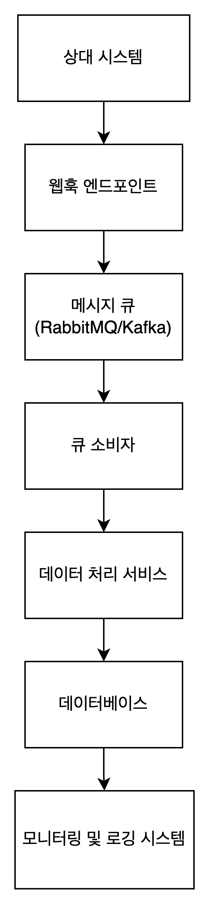

# 대용량 사용자 동기화 시스템

## 1. 프로젝트 개요
- **프로젝트 목표**: 다른 시스템의 사용자 정보를 받아와 대용량 데이터를 효과적으로 이전하고 이후에 데이터 변경이 있을 경우 실시간 동기화하는 프로그램을 구현
- **첫 데이터 이전 당시에 서버 로드를 고려하여 프로그램을 잘 구성하는 것이 제일의 목표**
- **데이터 종류**: 사용자 데이터 (아이디, 이름, 사번, 이메일, 소속, 직책, 메모)
- **데이터 동기화 주기와 방식**: 싨기간 동기화 방식 (웹훅 + 메시지 큐 사용)
- **성능 요구사항**: 서버 부하를 고려하여 큐 방식으로 구현

## 2. 시스템 아키텍처

### 주요 컴포넌트
1. **웹훅 엔드포인트**: 상대 시스템의 웹훅 요청을 수신.
2. **메시지 큐**: RabbitMQ 또는 Apache Kafka로 웹훅 이벤트를 큐잉.
3. **큐 소비자**: 큐에서 메시지를 소비하여 처리.
4. **데이터 처리 서비스**: 받은 데이터를 파싱하고 데이터베이스에 저장.
5. **데이터베이스**: 사용자 데이터를 저장.
6. **모니터링 및 로깅 시스템**: 애플리케이션 상태 모니터링 및 로깅.

### 데이터 흐름
1. **상대 시스템**이 사용자 데이터 변경 시 웹훅 요청을 **웹훅 ㅌ드포인트**로 전송.
2. **웹훅 엔드포인트**는 이벤트 데이터를 **메시지 큐**에 넣음.
3. **큐 소비자**는 **메시지 큐**에서 이벤트 메시지를 읽어 **데이터 처리 서비스**로 전달.
4. **데이터 처리 서비스**는 데이터를 파싱하고 검증하여 **데이터베이스**에 저장.
5. 모든 이벤트와 처리 과정을 **모니터링 및 로깅 시스템**에서 기록하고 모니터링.

### 시스템 아키텍처 다이어그램

### 구현 세부 사항
1. 웹훅 엔드포인트
- Spring Boot를 사용하여 웹훅 엔드포인트를 구현.
- 웹훅 요청을 수신하고 요청 데이터를 메시지 큐에 전송.
2. 메시지 큐 설정
- RabbitMQ 또는 Apache Kafka를 설정.
- 메시지 큐에 이벤트 데이터를 넣는 로직 구현.
3. 큐 소비자
- Spring Boot와 메시지 큐 클라이언트를 사용하여 큐 소비자 구현.
- 큐에서 메시지를 읽어 데이터 처리 서비스로 전달.
4. 데이터 처리 서비스
- 데이터를 파싱하고 검증하여 데이터베이스에 저장.
- Spring Data JPA를 사용하여 데이터베이스 연동.
5. 데이터베이스
- 사용자 데이터를 저장할 데이터베이스 (PostgreSQL)
- 필요한 엔티티와 리포지토리 구현.
6. 모니터링 및 로깅 시스템
- Spring Boot Actuator를 사용하여 애플리케이션 모니터링.
- Prometheus와 Grafana를 사용하여 성능 모니터링 대시보드 구성.
- SLF4J 및 Logback을 사용하여 로깅 설정.

## 3. 성공 기준
- 다른 시스템의 사용자 정보를 성공적으로 받아와 동기화
- 대용량 데이터 처리 시 서버의 부하 최소화
- 성능 및 안정성 테스트를 통과
- 모니터링 및 로깅을 통해 실시간으로 시스템 상태 파악

## 4. 추가 고려 사항
- 보안: 데이터 보호 및 접근 제어
- 확장성: 시스템이 확장 가능한 구조로 설계
- 유지보수: 코드의 가독성과 유지보수성을 고려한 설계